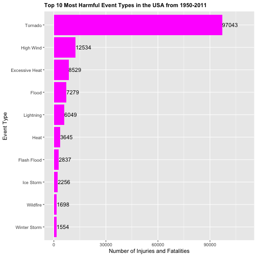
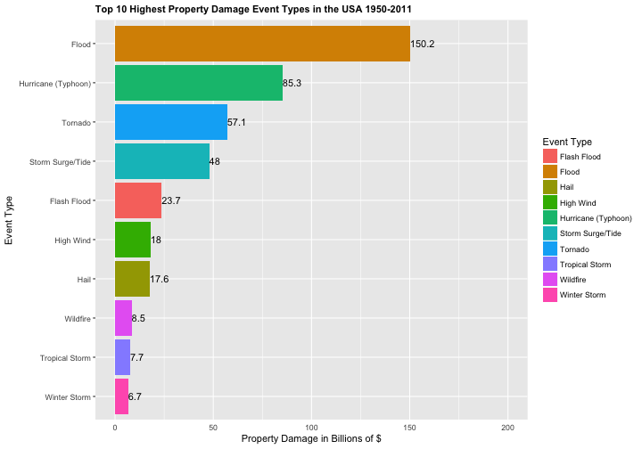
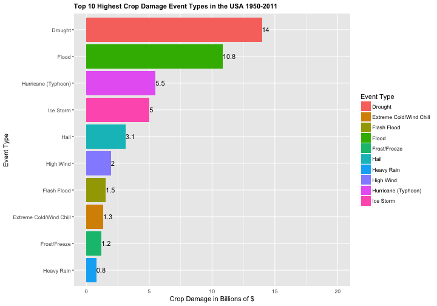

The goal of this analysis was to explore the impacts of various weather events on population health (i.e. injuries and fatalities) and the economic consequences of weather events(i.e. property damage and crop damage). The data is from the U.S National Oceanic and Atmospheric Administration's (NOAA) storm database, which tracks major storms and weather events in the United States. The data come in the form of a CSV file compressed via the bzip2 algorithm. The data are available here:

https://d396qusza40orc.cloudfront.net/repdata%2Fdata%2FStormData.csv.bz2

There is also documentation of the database where you can see how variables are defined:

https://d396qusza40orc.cloudfront.net/repdata%2Fpeer2_doc%2Fpd01016005curr.pdf

###Data Processing
To complete the analysis, you must first set your working directory, download the file to the directory and read in the file (this will take a while, it is a large file).


```r
#setwd()
storm_data <- read.csv("StormData.csv.bz2")
```

Load the necessary R packages.

```r
library(ggplot2)
library(dplyr)
```
According to the documentation, there are only 48 event types. However because of inconsistencies in database entry, there are closer to 1,000 event types. This means the event types need to be consolidated. The following does a major consolidation but ignores certain events that are not relevant to the analyses (for example, "AVALANCE" (sic)). First all of the events were made to uppercase for consistency, then the grep function was used to identify events and convert them to the event name given on the documentation sheet.


```r
storm_data$EVTYPE <- toupper(storm_data$EVTYPE)

storm_data$EVTYPE[grep("ASTRONOMICAL", storm_data$EVTYPE)] <- "Astronomical Low Tide"
storm_data$EVTYPE[grep("AVALANCHE", storm_data$EVTYPE)] <- "Avalanche"
storm_data$EVTYPE[grep("BLIZZARD", storm_data$EVTYPE)] <- "Blizzard"
storm_data$EVTYPE[grep("COASTAL", storm_data$EVTYPE)] <- "Coastal Flood"
storm_data$EVTYPE[grep("EXTREME", storm_data$EVTYPE)] <- "Extreme Cold/Wind Chill"
storm_data$EVTYPE[grep("COLD", storm_data$EVTYPE)] <- "Cold/Wind Chill"
storm_data$EVTYPE[grep("DEBRIS", storm_data$EVTYPE)] <- "Debris Flow"
storm_data$EVTYPE[grep("FOG", storm_data$EVTYPE)] <- "Dense Fog"
storm_data$EVTYPE[grep("HOT", storm_data$EVTYPE)] <- "Excessive Heat"
storm_data$EVTYPE[grep("SMOKE", storm_data$EVTYPE)] <- "Dense Smoke"
storm_data$EVTYPE[grep("DROUGHT", storm_data$EVTYPE)] <- "Drought"
storm_data$EVTYPE[grep("DEVIL", storm_data$EVTYPE)] <- "Dust Devil"
storm_data$EVTYPE[grep("DUST STORM", storm_data$EVTYPE)] <- "Dust Storm"
storm_data$EVTYPE[grep("DUSTSTORM", storm_data$EVTYPE)] <- "Dust Storm"
storm_data$EVTYPE[grep("EXCESSIVE", storm_data$EVTYPE)] <- "Excessive Heat"
storm_data$EVTYPE[grep("WARM", storm_data$EVTYPE)] <- "Excessive Heat"
storm_data$EVTYPE[grep("RECORD HIGH", storm_data$EVTYPE)] <- "Excessive Heat"
storm_data$EVTYPE[grep("UNSEASONABLY WARM", storm_data$EVTYPE)] <- "Excessive Heat"
storm_data$EVTYPE[grep("FLASH", storm_data$EVTYPE)] <- "Flash Flood"
storm_data$EVTYPE[grep("FLOOD", storm_data$EVTYPE)] <- "Flood"
storm_data$EVTYPE[grep("FROST", storm_data$EVTYPE)] <- "Frost/Freeze"
storm_data$EVTYPE[grep("FUNNEL", storm_data$EVTYPE)] <- "Funnel Cloud"
storm_data$EVTYPE[grep("FREEZING FOG", storm_data$EVTYPE)] <- "Freezing Fog"
storm_data$EVTYPE[grep("HAIL", storm_data$EVTYPE)] <- "Hail"
storm_data$EVTYPE[grep("HEAT", storm_data$EVTYPE)] <- "Heat"
storm_data$EVTYPE[grep("HEAVY RAIN", storm_data$EVTYPE)] <- "Heavy Rain"
storm_data$EVTYPE[grep("HEAVY SNOW", storm_data$EVTYPE)] <- "Heavy Snow"
storm_data$EVTYPE[grep("SURF", storm_data$EVTYPE)] <- "High Surf"
storm_data$EVTYPE[grep("WIND", storm_data$EVTYPE)] <- "High Wind"
storm_data$EVTYPE[grep("HURRICANE", storm_data$EVTYPE)] <- "Hurricane (Typhoon)"
storm_data$EVTYPE[grep("TYPHOON", storm_data$EVTYPE)] <- "Hurricane (Typhoon)"
storm_data$EVTYPE[grep("ICE", storm_data$EVTYPE)] <- "Ice Storm"
storm_data$EVTYPE[grep("LAKE-EFFECT", storm_data$EVTYPE)] <- "Lake-Effect Snow"
storm_data$EVTYPE[grep("LAKESHORE", storm_data$EVTYPE)] <- "Lakeshore Flood"
storm_data$EVTYPE[grep("LIGHTNING", storm_data$EVTYPE)] <- "Lightning"
storm_data$EVTYPE[grep("LIGNTNING", storm_data$EVTYPE)] <- "Lightning"
storm_data$EVTYPE[grep("LIGHTING", storm_data$EVTYPE)] <- "Lightning"
storm_data$EVTYPE[grep("MARINE HAIL", storm_data$EVTYPE)] <- "Marine Hail"
storm_data$EVTYPE[grep("MARINE HIGH WIND", storm_data$EVTYPE)] <- "Marine High Wind"
storm_data$EVTYPE[grep("MARINE STRONG WIND", storm_data$EVTYPE)] <- "Marine Strong Wind"
storm_data$EVTYPE[grep("MARINE THUNDERSTORM WIND", storm_data$EVTYPE)] <- "Marine Thunderstorm Wind"
storm_data$EVTYPE[grep("RIP", storm_data$EVTYPE)] <- "Rip Current"
storm_data$EVTYPE[grep("SEICHE", storm_data$EVTYPE)] <- "Seiche"
storm_data$EVTYPE[grep("SLEET", storm_data$EVTYPE)] <- "Sleet"
storm_data$EVTYPE[grep("STORM SURGE", storm_data$EVTYPE)] <- "Storm Surge/Tide"
storm_data$EVTYPE[grep("STRONG", storm_data$EVTYPE)] <- "Strong Wind"
storm_data$EVTYPE[grep("THUNDERSTORM WIND", storm_data$EVTYPE)] <- "Thunderstorm Wind"
storm_data$EVTYPE[grep("^THUNDERSTORM", storm_data$EVTYPE)] <- "Thunderstorm Wind"
storm_data$EVTYPE[grep("MARINE HIGH WIND", storm_data$EVTYPE)] <- "Marine High Wind"
storm_data$EVTYPE[grep("TORNADO", storm_data$EVTYPE)] <- "Tornado"
storm_data$EVTYPE[grep("TORNDAO", storm_data$EVTYPE)] <- "Tornado"
storm_data$EVTYPE[grep("DEPRESSION", storm_data$EVTYPE)] <- "Tropical Depression"
storm_data$EVTYPE[grep("TSTM", storm_data$EVTYPE)] <- "Tropical Storm"
storm_data$EVTYPE[grep("TROPICAL STORM", storm_data$EVTYPE)] <- "Tropical Storm"
storm_data$EVTYPE[grep("TSUNAMI", storm_data$EVTYPE)] <- "Tsunami"
storm_data$EVTYPE[grep("ASH", storm_data$EVTYPE)] <- "Volcanic Ash"
storm_data$EVTYPE[grep("WATERSPOUT", storm_data$EVTYPE)] <- "Waterspout"
storm_data$EVTYPE[grep("WATER SPOUT", storm_data$EVTYPE)] <- "Waterspout"
storm_data$EVTYPE[grep("MARINE HIGH WIND", storm_data$EVTYPE)] <- "Marine High Wind"
storm_data$EVTYPE[grep("FIRE", storm_data$EVTYPE)] <- "Wildfire"
storm_data$EVTYPE[grep("WINTER STORM", storm_data$EVTYPE)] <- "Winter Storm"
storm_data$EVTYPE[grep("WINTER WEATHER", storm_data$EVTYPE)] <- "Winter Weather"
storm_data$EVTYPE[grep("WINTER", storm_data$EVTYPE)] <- "Winter Weather"
storm_data$EVTYPE[grep("SNOW", storm_data$EVTYPE)] <- "Winter Weather"
storm_data <- storm_data[- grep("SUMMARY", storm_data$EVTYPE), ]
```

Now that the event names have been consolidated, the data can be grouped and graphed. I created one graph that utilizes a variable that adds fatalities and injuries together, but the code could be easily modified to create two graphs that show fatalities vs injuries.


```r
storm_data_top_10 <- storm_data %>%
                mutate(INJURIES_FATALITIES = FATALITIES + INJURIES) %>%
                select(EVTYPE, INJURIES_FATALITIES) %>%
                group_by(EVTYPE) %>%
                summarize(INJURIES_FATALITIES = sum(INJURIES_FATALITIES)) %>%
                arrange(desc(INJURIES_FATALITIES)) %>%
                top_n(10, INJURIES_FATALITIES)

ggplot(storm_data_top_10, aes(x = reorder(EVTYPE, INJURIES_FATALITIES), INJURIES_FATALITIES)) + 
                geom_bar(stat = "identity", fill = "magenta") + 
                ggtitle("Top 10 Most Harmful Event Types in the USA from 1950-2011") + 
                coord_flip() + 
                ylab("Number of Injuries and Fatalities") + 
                xlab("Event Type") + 
                geom_text(aes(label = INJURIES_FATALITIES), hjust = 0) + 
                theme(plot.title = element_text(size = rel(1),lineheight = 0, face = "bold")) + 
                ylim(0, 110000)
```



To look at the economic impact of storm events, the variables of interest are property damage (PROPDMG) and its multiplier (PROPDMGEXP) as well as crop damage (CROPDMG) and its multiplier (CROPDMGEXP). The multiplier indicates how to convert the damage variable into the true cost (for example, for a PROPDMG value of 25 and a PROPDMGEXP of M, 25 needs to be multiplied by 1,000,000). The PROPDMGEXP variable has the following levels:

""  "-" "?" "+" "0" "1" "2" "3" "4" "5" "6" "7" "8" "B" "h" "H" "K" "m" "M"

We will ignore "-", "+" and "?" since those only make up 14 entries. Blank cells indicate 0. The numbers how many zeros to add to 10 as a multiplier for the PROPDMG value (for example, "0"" = 10, "1" = 100, etc.). The letters indicate whether the PROPDMG value should be multiplied by 1 thousand ("K""), 1 million ("m" or "M") or 1 billions ("B"). The same is true for the the crop damage variable, but it only has the following levels:

? 0 2 B k K m M

To get the correct values for each, I first removied rows with blank cells, then converted the multipliers to actual numbers, multiplied these numbers by the PROPDMG/CROPDMG variables, then merged the updated dataframe with the dataframe that had blank multipliers.

```r
storm_data_blanks <- storm_data[storm_data$PROPDMGEXP == "", ]

storm_data_blanks_narrowed <- storm_data_blanks %>%
                mutate(Property_Damage = PROPDMG) %>%
                select(EVTYPE, Property_Damage)

storm_data_econ <- storm_data %>%
                select(EVTYPE, PROPDMG, PROPDMGEXP) %>%
                filter(PROPDMGEXP != "-" & PROPDMGEXP != "+" & PROPDMGEXP != "?" & PROPDMG != "")

#0 - 8 are multipliers of 10
##############
storm_data_econ$PROPDMGEXP <- gsub(pattern = "^1", replacement = "100", x = storm_data_econ$PROPDMGEXP)
storm_data_econ$PROPDMGEXP <- gsub(pattern = "^2", replacement = "1000", x = storm_data_econ$PROPDMGEXP)
storm_data_econ$PROPDMGEXP <- gsub(pattern = "^3", replacement = "10000", x = storm_data_econ$PROPDMGEXP)
storm_data_econ$PROPDMGEXP <- gsub(pattern = "^4", replacement = "100000", x = storm_data_econ$PROPDMGEXP)
storm_data_econ$PROPDMGEXP <- gsub(pattern = "^5", replacement = "1000000", x = storm_data_econ$PROPDMGEXP)
storm_data_econ$PROPDMGEXP <- gsub(pattern = "^6", replacement = "10000000", x = storm_data_econ$PROPDMGEXP)
storm_data_econ$PROPDMGEXP <- gsub(pattern = "^7", replacement = "100000000", x = storm_data_econ$PROPDMGEXP)
storm_data_econ$PROPDMGEXP <- gsub(pattern = "^8", replacement = "1000000000", x = storm_data_econ$PROPDMGEXP)
storm_data_econ$PROPDMGEXP <- gsub(pattern = "^k|K", replacement = "1000", x = storm_data_econ$PROPDMGEXP)
storm_data_econ$PROPDMGEXP <- gsub(pattern = "^m|M", replacement = "1000000", x = storm_data_econ$PROPDMGEXP)
storm_data_econ$PROPDMGEXP <- gsub(pattern = "^B|b", replacement = "1000000000", x = storm_data_econ$PROPDMGEXP)
storm_data_econ$PROPDMGEXP <- sub(pattern = "^0", replacement = "10", x = storm_data_econ$PROPDMGEXP)
##########
storm_data_econ$PROPDMGEXP <- as.numeric(storm_data_econ$PROPDMGEXP)
```

```
## Warning: NAs introduced by coercion
```

```r
subsetted_storm <- storm_data_econ %>%
                filter(PROPDMGEXP > 0)

storm_data_property_damage <- subsetted_storm%>%
                mutate(Property_Damage = PROPDMG*PROPDMGEXP) %>%
                select(EVTYPE, Property_Damage)

binded_property_damage <- rbind(storm_data_blanks_narrowed, storm_data_property_damage)
```

Here is the graph for property damage by event type.


```r
property_damage_top_10 <- binded_property_damage %>%
                group_by(EVTYPE) %>%
                summarize(Property_Damage = sum(Property_Damage)) %>%
                arrange(desc(Property_Damage)) %>%
                top_n(10, Property_Damage)

ggplot(property_damage_top_10, aes(x = reorder(EVTYPE, Property_Damage), Property_Damage/10^9)) + 
                geom_bar(stat = "identity", aes(fill = EVTYPE)) + 
                coord_flip() +
                ggtitle("Top 10 Highest Property Damage Event Types in the USA 1950-2011") + 
                ylab("Property Damage in Billions of $") + 
                xlab("Event Type") + 
                theme(axis.ticks.x = element_blank()) + 
                geom_text(aes(label = round(Property_Damage/1000000000, 1), hjust = 0)) + 
                theme(plot.title = element_text(size = rel(1),lineheight = 0, face = "bold")) + 
                ylim(0, 200) + 
                scale_fill_discrete(name = "Event Type")
```



Now the same thing for crop damage

```r
##now crop damage
storm_data_crop_blanks <- storm_data[storm_data$CROPDMGEXP == "", ]

storm_data_crops_narrowed <- storm_data_crop_blanks %>%
                mutate(Crop_Damage = CROPDMG) %>%
                select(EVTYPE, Crop_Damage)

storm_data_crop_damage <- storm_data %>%
                select(EVTYPE, CROPDMG, CROPDMGEXP) %>%
                filter(CROPDMG != "?") #might need to fix?
#############
storm_data_crop_damage$CROPDMGEXP <- gsub(pattern = "^0", replacement = "10", x = storm_data_crop_damage$CROPDMGEXP)
storm_data_crop_damage$CROPDMGEXP <- gsub(pattern = "^2", replacement = "1000", x = storm_data_crop_damage$CROPDMGEXP)
storm_data_crop_damage$CROPDMGEXP <- gsub(pattern = "^B", replacement = "1000000000", x = storm_data_crop_damage$CROPDMGEXP)
storm_data_crop_damage$CROPDMGEXP <- gsub(pattern = "^k|K", replacement = "1000", x = storm_data_crop_damage$CROPDMGEXP)
storm_data_crop_damage$CROPDMGEXP <- gsub(pattern = "^m|M", replacement = "1000000", x = storm_data_crop_damage$CROPDMGEXP)
#############
storm_data_crop_damage$CROPDMGEXP <- as.numeric(storm_data_crop_damage$CROPDMGEXP)
```

```
## Warning: NAs introduced by coercion
```

```r
subsetted_crop_damage <- storm_data_crop_damage %>%
                filter(CROPDMGEXP > 0)

storm_crop_damage <- subsetted_crop_damage%>%
                mutate(Crop_Damage = CROPDMG*CROPDMGEXP) %>%
                select(EVTYPE, Crop_Damage)

binded_crop_damage <- rbind(storm_data_crops_narrowed, storm_crop_damage)
```

Finally, here is the graph for the crop damage by event type.


```r
crop_damage_top_10 <- binded_crop_damage %>%
                group_by(EVTYPE) %>%
                summarize(Crop_Damage = sum(Crop_Damage)) %>%
                arrange(desc(Crop_Damage)) %>%
                top_n(10, Crop_Damage)

ggplot(crop_damage_top_10, aes(x = reorder(EVTYPE, Crop_Damage), Crop_Damage/10^9)) + 
                geom_bar(stat = "identity", aes(fill = EVTYPE)) + 
                coord_flip() +
                ggtitle("Top 10 Highest Crop Damage Event Types in the USA 1950-2011") + 
                ylab("Crop Damage in Billions of $") + 
                xlab("Event Type") + 
                theme(axis.ticks.x = element_blank()) + 
                geom_text(aes(label = round(Crop_Damage/1000000000, 1), hjust = 0)) + 
                theme(plot.title = element_text(size = rel(1),lineheight = 0, face = "bold")) + 
                ylim(0, 20) + 
                scale_fill_discrete(name = "Event Type")
```



### Results
To summarize, it appears that tornados have resulted in the highest number of total deaths and injuries for the 61 year period. The most impactful event on property damage has been flooding while the most impactful event on crop damage has been drought.
